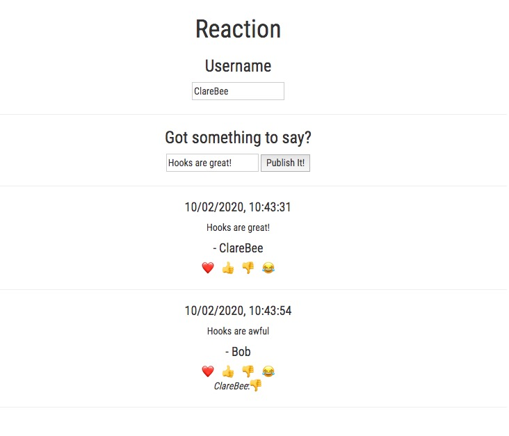

## React Hooks Tutorial

[React Hooks Course on Udemy](https://www.udemy.com/course/react-hooks-tutorial/) by David Joseph Katz

### Notes from course:
**useState** - allows attachment of local state data to component

**useEffect** - allows application of side effects to component, fires after every render.
- 1st param = callback function
- 2nd param = array of values. If values change, React will refire the callback. Empty array = one time only.

**Custom hooks** - shared by >1 component, with differences passed in as params

**Closure for the useEffect callback** - variables for callback are encapsulated in a JavaScript closure, so original values will persist.

**The callback function for the useState setter**
> A solution to the above problem is use a callback for the useState setter. Instead of using the value for the state variable, when the useEffect callback was created, the callback in the useState setter allows you to use the variable as it’s currently stored in the React engine.

**Return a callback with useEffect to cleanup**
>- React will fire the returned callback of a useEffect hook to apply any cleanup code that you need once the effect is completed. An effect completes in this way, either on the next render of the component, or when the component unmounts from the DOM.

**UseReducer** - allows application of reducer pattern to app & components. Pull out state into centralised object; collects data via dispatching action object to reducer.

**UseContext** - allows application of React context object to tree of React components. Nested components in that tree can reference shared objects & data.
